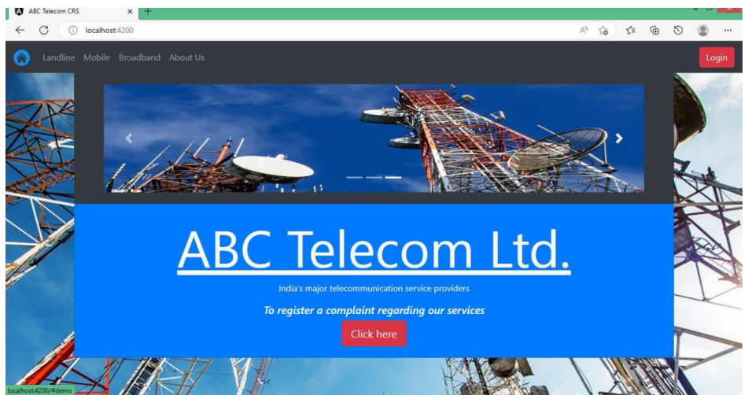
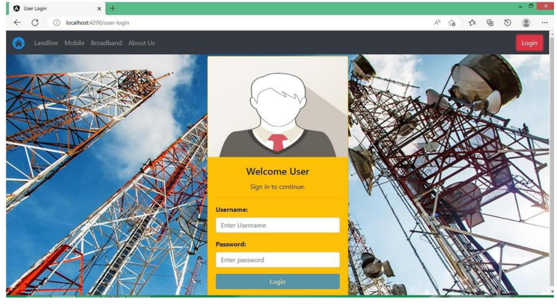
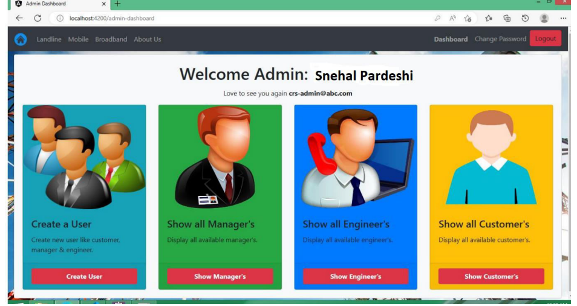
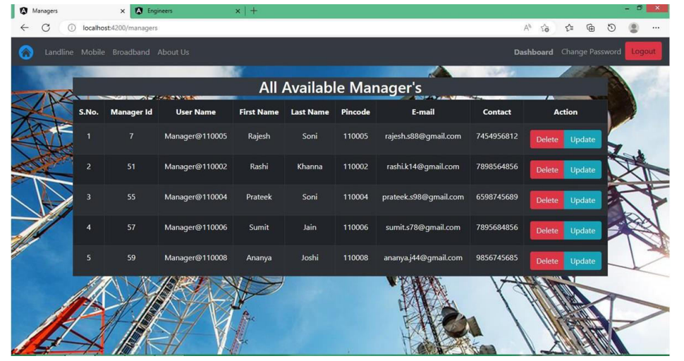
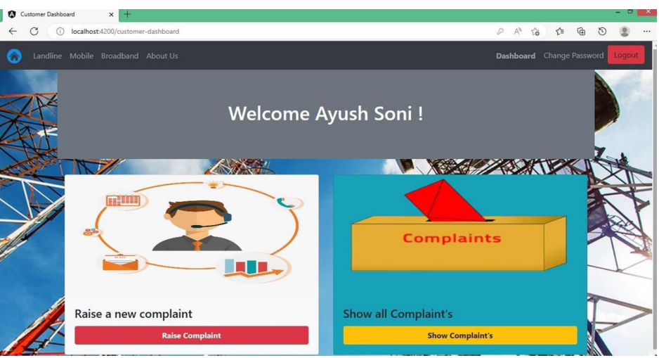

<h2 align="center">Complaint Redressal System</h2>
An online complaint management system for landline and broadband services built with Angular, Spring Boot. Users can log and track complaints seamlessly, with a secure backend using Spring Data JPA and RESTful APIs via Spring Web. The frontend, built in TypeScript, provides an intuitive interface for managing service-related issues efficiently.

 

### Demo Screeshots

 

 

 

 

